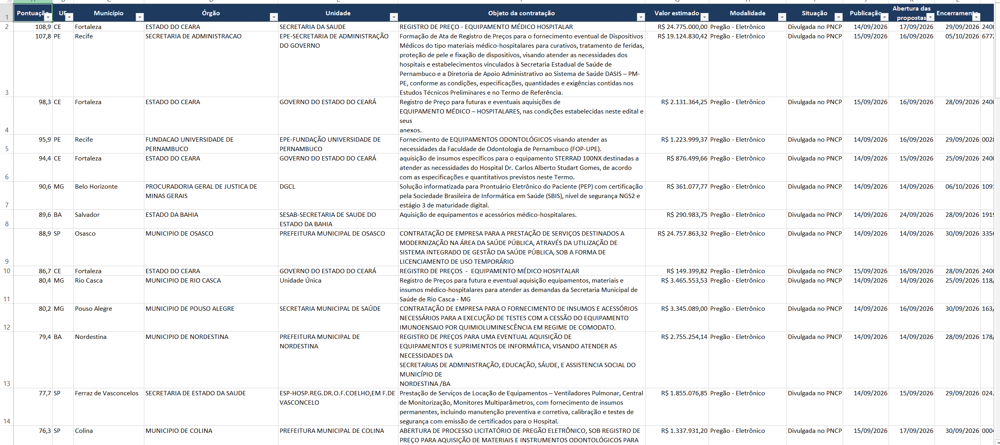
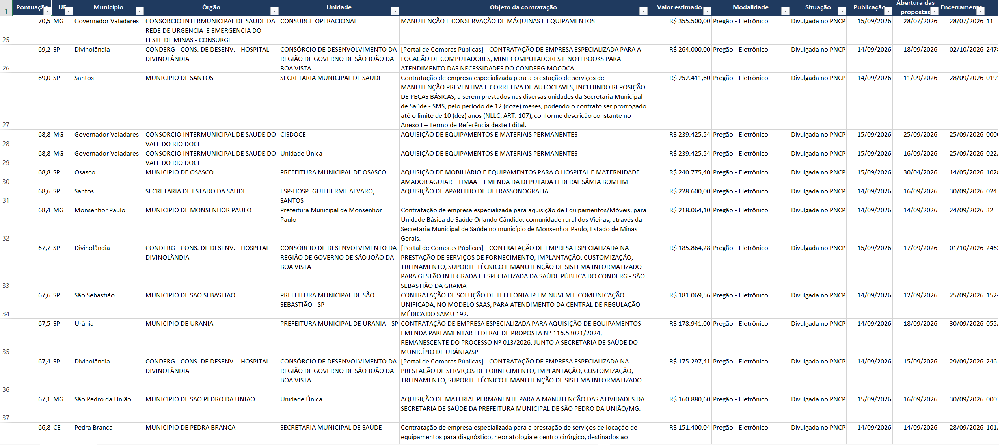
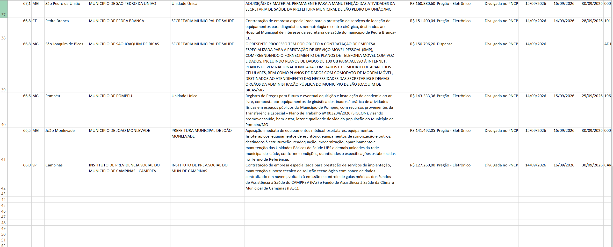
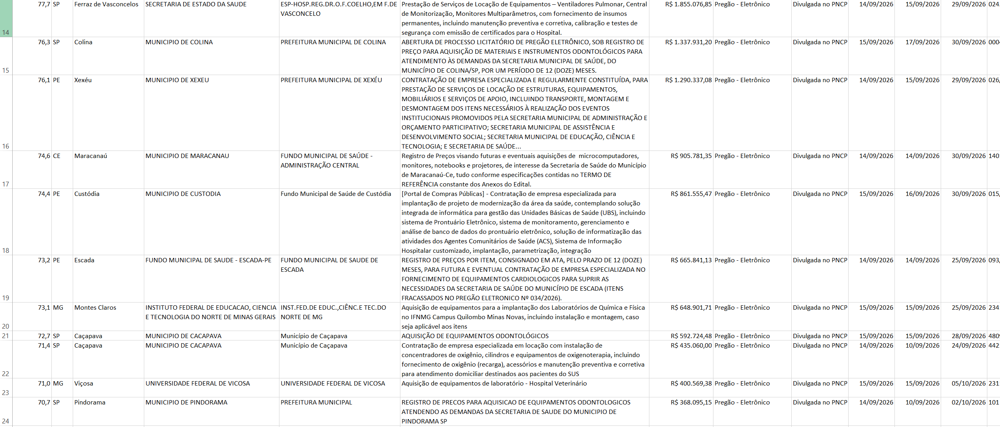
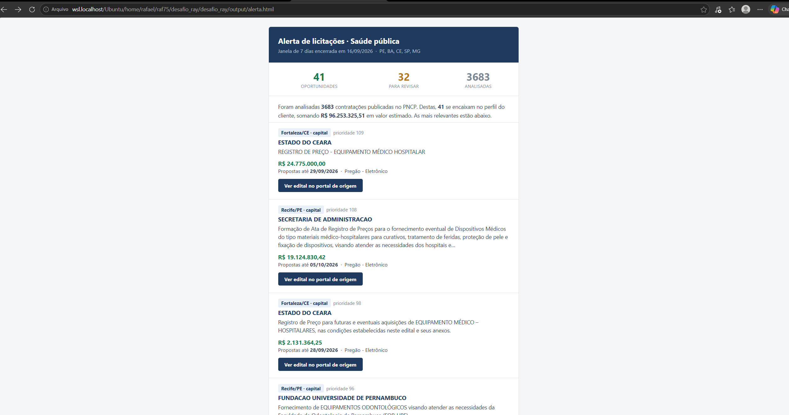

# Automação M.I. – Rafael

Alerta de licitações de saúde pública a partir do **PNCP**: coleta as contratações
publicadas, filtra o que interessa a um fornecedor de equipamentos e tecnologia
para saúde, e gera uma planilha de trabalho e um e-mail de alerta.

**Repositório:** https://github.com/raf7525/desafio_ray

Numa coleta de 7 dias (5 UFs, modalidades 6 e 8): **3.683 licitações
analisadas**, **41 aprovadas** (1,1%), **32 mandadas para revisão humana**.

```
API do PNCP ──> data/raw/*.json ──> tabela tratada ──> filtro ──> SQLite
                (bruto, intocado)                                  │
                                                                   ├──> output/oportunidades.xlsx
                                                                   └──> output/alerta.html
```

---

## Declaração uso de IA
Utilizei o Cloud na estruturação dos códigos, fazer o front-end do email e me ajudar a corrigir e complementar o ReadMe, a parte da lógica da aplicação foi feita por mim, sendo utilizado o cloud apenas para gerar códigos massivos como prints e configurações de palavras (nos arquivos config.py).


## Como executar do zero

```bash
git clone https://github.com/raf7525/desafio_ray.git
cd desafio_ray

python3 -m venv .venv
source .venv/bin/activate          # Windows: .venv\Scripts\activate
pip install -r requirements.txt

python main.py
```

A API do PNCP é pública — não há chave, senha ou `.env` para configurar.

A coleta são ~150 requisições à API, alguns minutos. Ela grava o JSON bruto em
`data/raw/AAAA-MM-DD/`, e a partir daí dá para reprocessar o disco **em 1 segundo**,
sem tocar na rede:

```bash
python main.py --reprocessar data/raw/2026-09-15    # a pasta que a coleta criou
```

Foi por essa rota que as palavras-chave foram ajustadas. `data/` não é versionado:
os dados são gerados na sua máquina ao rodar.

Outras opções: `--dias 30` (janela maior), `--saida DIR`, `--banco ARQUIVO`,
`--destaques N` (quantas oportunidades o e-mail mostra).

> Se `python3 -m venv` falhar com *"ensurepip is not available"* (comum em WSL):
> `apt install python3-venv`, ou crie com `python3 -m venv --without-pip .venv` e
> instale o pip via [get-pip.py](https://bootstrap.pypa.io/get-pip.py).

---

## Estrutura

```
desafio_ray/
├── main.py                     Orquestra o pipeline; --reprocessar pula a API
├── config.py                   TODA a regra de negócio: UFs, modalidades, janela,
│                               valor mínimo, pesos e as 4 listas de palavras-chave
├── src/
│   ├── coleta/pncp_client.py   Requisições, paginação, retry, gravação do bruto
│   ├── tratamento/
│   │   ├── parser.py           JSON aninhado -> tabela plana, tipada, sem duplicatas
│   │   ├── filtro.py           Classifica em aprovado / revisar / descartado
│   │   │                       e aplica o corte por valor mínimo
│   │   └── pontuacao.py        Ordena as aprovadas por prioridade comercial
│   ├── persistencia/banco.py   SQLite: UPSERT por id_pncp, histórico entre execuções
│   └── entregas/
│       ├── planilha.py         .xlsx com 3 abas, formatado para uso direto
│       └── email_html.py       E-mail de alerta, CSS inline, texto escapado
├── data/                       gerado ao rodar, fora do controle de versão
│   ├── raw/AAAA-MM-DD/         JSON bruto da coleta, um arquivo por página
│   └── processed/              licitacoes.db
└── output/                     oportunidades.xlsx e alerta.html
```

Coleta, filtro e entregas são separados porque mudam por razões diferentes — e o
filtro isolado pode ser testado com dados de disco, sem rede.

---

## Como o filtro foi definido

Cada critério do cliente é aplicado no ponto mais barato:

| Critério | Onde | Por quê ali |
|---|---|---|
| **UF** (PE, BA, CE, SP, MG) | na chamada à API | A API filtra na origem; baixar o Brasil para descartar 22 estados é desperdício de rede. |
| **Assunto** (palavras-chave) | em memória, `filtro.py` | A API **não tem busca por texto**. Não há alternativa. |
| **Valor mínimo** (R$ 100.000) | em memória, após o assunto | Fica depois para a evidência registrar *os dois* motivos quando ambos se aplicam. |

As listas foram medidas contra o corpus real, não supostas. **Casamento por
substring é inutilizável** — `if palavra in texto` produz desastres silenciosos:

| Termo | Casa dentro de | Falsos positivos |
|---|---|---|
| `uti` | hortifr**uti**, **uti**lização | 201 |
| `ubs` | s**ubs**crição, s**ubs**tituição | 47 |
| `upa` | ro**upa**, equ**ipa**mento | 29 |
| `sistema` | **Sistema** de Registro de Preços | 26 |

Por isso o filtro casa por **palavra inteira** (fronteira regex), e `sistema` virou
`sistema de gestão`, `sistema informatizado`, `sistema de informação`. Alguns termos
do ramo são 100% enganosos e nem fronteira resolve: `servidor` aparece 94 vezes,
**todas** significando *servidor público*.

### O desenho: duas dimensões

O filtro cruza **o que se compra** × **contexto de saúde**, em quatro listas
(todas em `config.py`):

| Lista | Tamanho | Papel |
|---|---|---|
| `PRODUTOS_INEQUIVOCOS` | 51 | Sozinhos provam o ramo: `desfibrilador`, `prontuário eletrônico` |
| `PRODUTOS_AMBIGUOS` | 53 | Genéricos: `equipamento`, `software`. **Só valem com contexto junto** |
| `CONTEXTO_SAUDE` | 30 | `saúde`, `hospital`, `UPA`, `SAMU`, `atenção básica` |
| `EXCLUSOES` | 94 | O que o cliente não fornece |

**O contexto é buscado no objeto E no nome do órgão comprador** — a principal arma
contra falso negativo, porque o órgão é um sinal independente do texto do edital:

```
objeto: "Aquisição de Equipamentos para a Rede de Atenção Básica"
órgão:  "SECRETARIA MUNICIPAL DE SAÚDE"                 -> APROVADO
```

Sem essa dimensão a licitação seria descartada: `equipamento` sozinho pega grupo
gerador e utensílio de cozinha. **Das 41 aprovações, 29 (71%) vieram dessa regra** —
um filtro de uma dimensão perderia dois terços das oportunidades.

**Conflito não descarta — vai para revisão.** "Ambulância equipada com equipamento
médico" e "equipamento médico para ambulâncias do SAMU" têm as mesmas palavras e
objetos opostos. Em vez de uma regra que erra metade dos casos em silêncio, os 32
conflitos vão para revisão manual. Toda licitação sai do filtro com o motivo escrito
na coluna `evidencia`:

```
produto do ramo: equipamento medico
produto genérico (equipamento) em contexto de saúde (medic, hospital)
produto do ramo: medico hospitalar  MAS casa em exclusão: material medico
```

É isso que torna o refinamento das listas um processo, e não um chute.

---

## Limitações do filtro

**Falsos positivos que permanecem:** `laboratório` conta como contexto de saúde,
então "Laboratório de Ensaios Tecnológicos" entra; TI genérica em órgão de saúde
("Telefonia Fixa e Móvel" para uma secretaria) é aprovada; "equipamentos diversos"
não diz o que se compra e passa pelo contexto. As 94 exclusões nasceram de falsos
positivos **observados**, não imaginados: ar-condicionado, EPIs, grupo gerador,
gases medicinais, plano de saúde, home care.

**Falsos negativos conhecidos**

- **Negação não é tratada:** `"sem comodato de equipamentos"` é lido como presença.
- **Lote misto:** "Equipamentos médico-hospitalares **e material de limpeza**" cai em
  revisão em vez de aprovação. Escolhi esse custo: num alerta comercial o erro caro é
  o falso positivo — se o e-mail encher de merenda, o time para de abri-lo.
- **Vocabulário fora da lista:** `RIS/PACS`, `sistema de laudos`.

**Limitação do dado, não do filtro:** `telemedicina`, `telessaúde` e `teleconsulta`
têm **zero ocorrências** nas 3.683 licitações. O cliente declara interesse, mas o
PNCP não publica com esse vocabulário na janela analisada.

**Limitação estrutural:** é correspondência literal, sem semântica. Não entende
sinônimos, não lê o anexo do edital e não sabe qual item do lote é o relevante.

---

## As duas entregas

**`output/oportunidades.xlsx`** — três abas, porque três públicos olham o arquivo:
**Oportunidades** (vendedor: as aprovadas por prioridade), **Revisar** (analista: os
conflitos, com as palavras que colidiram) e **Resumo** (gestor: totais, valor somado,
distribuição por UF). Pronta para uso, não como dump: cabeçalho congelado, filtro
automático, valor em moeda, data `dd/mm/aaaa`, link clicável. A coluna **"Por que
entrou"** é o que torna a discordância útil — *"não interessa, e o motivo que o robô
deu foi X"* ajusta a lista; *"o robô errou"* não.

**`output/alerta.html`** — o e-mail é a isca, não o relatório: os números da semana,
as 10 melhores em cartões (órgão, objeto, valor, prazo, link), e o resto na planilha.
Gmail e Outlook removem `<style>` e ignoram flexbox, então o layout é `<table>`
aninhada com CSS inline; e como `objeto` e `orgao` são campos livres de milhares de
prefeituras, tudo passa por `html.escape` — sem isso um `<` quebraria o layout e um
edital malicioso injetaria HTML no e-mail de todo mundo.

> **O e-mail é gerado como arquivo, não enviado.** Enviar exigiria credenciais SMTP,
> e o enunciado as proíbe no repositório. Seria uma chamada de `smtplib` lendo
> variáveis de ambiente, e preferi não adicionar código que não consigo demonstrar
> rodando.

---

## Decisões e porquês

**Bruto em JSON, um arquivo por página.** O enunciado exige o retorno sem
transformação, e o PNCP devolve objetos aninhados; CSV só aceita tabela plana, e
achatar na coleta *é* uma transformação. Um arquivo por página dá rastreabilidade,
resiliência (se cair na página 100, as 99 estão no disco) e reprocessamento.

**Tratado em SQLite, porque a entrega é um alerta periódico.** Execuções sucessivas
cobrem janelas que se sobrepõem, então as mesmas licitações reaparecem; com
`id_pncp` como chave primária o `ON CONFLICT DO UPDATE` resolve isso sem custo,
enquanto um CSV exigiria reconciliar o arquivo inteiro a cada rodada. O ganho
concreto é a coluna `vista_em`, que guarda a **primeira** aparição e nunca é
sobrescrita: é ela que responde *"o que é novo desde a semana passada"*. SQLite e não
Postgres porque é biblioteca padrão — zero dependências, zero servidor. O banco
recebe a tabela inteira, não só as aprovadas: o descartado de hoje é a evidência de
por que o filtro decidiu assim.

**Duplicidade, em duas camadas.** `numeroControlePNCP` é o identificador único do
próprio PNCP, não uma combinação improvisada de campos:

| Camada | Onde | Resolve |
|---|---|---|
| `drop_duplicates` | `parser.py` | A mesma contratação em mais de uma fatia **da mesma coleta** |
| `ON CONFLICT DO UPDATE` | `banco.py` | A mesma contratação **entre execuções**, por sobreposição de janela |

A primeira só enxerga a rodada atual; a segunda sozinha faria o banco trabalhar à toa
com milhares de linhas que dava para descartar em memória.

**Erros.** Retry com backoff exponencial (1s, 2s, 4s, 8s, 16s) para 429 e 5xx — sem
isso uma coleta de centenas de requisições morre por erro passageiro. Se uma fatia
UF × modalidade falhar mesmo após os retries, vai para o log e as outras continuam. A
parada do loop é pela lista de dados (`data` vazio ou `totalPaginas` alcançado), não
pelo código de status.

**Janela e modalidades.** 7 dias, modalidades 6 (Pregão) e 8 (Dispensa). As
modalidades 4 e 9 ficaram de fora porque dobram o tempo de coleta — **decisão de
custo, não medição**: não avaliei quantas oportunidades vivem nelas.

---

## Dificuldades encontradas

**1. A API sinaliza ausência de resultados com `HTTP 204` e corpo vazio**, não com
`200` e lista vazia — e `.json()` nessa resposta estoura `JSONDecodeError`. Em vez de
checar o status, o loop lê `totalPaginas` e para nele, então nunca pede página além
do fim; para a fatia vazia, `JSONDecodeError` é subclasse de `RequestException` e cai
no tratamento de falha por fatia que já existe.

**2. `tamanhoPagina` tem mínimo *e* máximo:** abaixo de 10 e acima de 50 a API
responde `400`. O mínimo não é documentado de forma evidente.

**3. `codigoModalidadeContratacao` é obrigatório e aceita um valor por chamada**, o
que transforma a coleta num produto cartesiano UF × modalidade × página.

**4. Volume.** 7 dias × 5 UFs × 2 modalidades deu ~150 páginas. Como cada fatia é
independente e o gargalo é rede, um `ThreadPoolExecutor` faz o tempo total virar o da
fatia mais lenta em vez da soma; a `Session` é compartilhada porque o pool do
`urllib3` já é thread-safe.

**5. `valorTotalEstimado` vem `null` *e* vem `0.00`.** O zero é o traiçoeiro: não é
capturado por `isna()`, passa pela verificação de nulo e reprova no corte de valor,
sumindo em silêncio — **404 registros** no corpus, um deles "Filmes Radiológicos com
Equipamentos em Regime de Comodato", exatamente o que interessa ao cliente.

**6. Acentuação.** Sem normalizar, `prontuário` nunca casa com `prontuario`, e
`médico-hospitalar` e `médico hospitalar` (19 e 28 ocorrências) seriam textos
diferentes. A normalização converte pontuação em espaço e une as duas grafias.

**7. HTML de e-mail é tecnologia parada em 2005.** Descobrir que Gmail e Outlook
descartam `<style>` depois de escrever o template com CSS moderno custou uma
reescrita inteira.

**8. O driver do `sqlite3` não aceita tipos do NumPy.** `numpy.int64`, `pd.Timestamp`
e `pd.NaT` vêm do DataFrame e estouram `InterfaceError`. `.item()` resolve os
escalares, mas só depois de tratar `NaT` e `NaN` à parte, porque eles sobrevivem à
conversão e viram lixo no lugar de `NULL`.

---

## Capturas de tela

### Planilha — aba *Oportunidades*

As 41 aprovadas, ordenadas da maior para a menor pontuação. Como não cabem numa
tela só, seguem em quatro partes.

**Linhas 1–14**



**Linhas 14–26**



**Linhas 26–34**



**Linhas 34–41**



### E-mail de alerta



---

## O que faria diferente com mais tempo

- **Busca semântica por embeddings** no lugar de correspondência literal: resolveria
  sinônimos, siglas e a negação, e capturaria "RIS/PACS" sem antecipar cada grafia.
- **Coleta incremental** usando o `vista_em` para consultar só o intervalo ainda não
  coberto. A estrutura já existe; faltou o recorte na chamada da API.
- **Separar "novas" de "já vistas" no alerta** — o banco já sabe quais são inéditas,
  mas o e-mail mostra todas as aprovadas. É o próximo passo de maior retorno.
- **Otimiar a extração de dados" Buscaria maneiras mais rapidas de extrair os dados.
- **Painel de refinamento** para o comercial marcar aprovações erradas, alimentando
  as listas com rótulos reais em vez de inspeção manual.
- **Testes automatizados** do filtro com objetos rotulados, para refinar uma keyword
  sem quebrar outra silenciosamente.

